# 🛡️ SentinelX

> A modern Security Operations Center (SOC) platform for managing security incidents, assets, audit logs, notifications, and reports.


---

## 🚀 Live Demo

Frontend

https://sentinel-x-frontend-six.vercel.app

Backend

https://sentinelxbackend-production.up.railway.app/api/health

---

# ✨ Features

- JWT Authentication
- Role-Based Access Control (Admin, Analyst, Viewer)
- Incident Management
- Asset Management
- Dashboard Analytics
- Notifications
- Audit Logs
- Reports
- Team Management
- Settings
- Swagger API Documentation
- Responsive UI
- Seed Database

---

# 🛠 Tech Stack

## Frontend

- React
- TypeScript
- Vite
- TailwindCSS
- Zustand
- Axios
- React Router

## Backend

- Node.js
- Express
- TypeScript
- Prisma ORM
- JWT
- RBAC
- Zod Validation
- Swagger

## Database

- PostgreSQL (Neon)

## Deployment

- Vercel
- Railway

---

# 📂 Project Structure

```
SentinelX/
│
├── frontend/
│   ├── src/
│   ├── public/
│   └── vite.config.ts
│
├── backend/
│   ├── prisma/
│   ├── src/
│   └── tests/
│
├── docker/
│
└── README.md
```

---

# ⚙️ Installation

Clone the repository

```bash
git clone https://github.com/KOWSHIK-4/SentinelX.git
```

Install dependencies

```bash
npm install
```

Run backend

```bash
cd backend
npm run dev
```

Run frontend

```bash
cd frontend
npm run dev
```

---

# 🔐 Environment Variables

Backend

```env
DATABASE_URL=
JWT_SECRET=
PORT=
CORS_ORIGIN=
```

Frontend

```env
VITE_API_URL=
```

---

# 📸 Screenshots

## Login

(Add Screenshot)

## Dashboard

(Add Screenshot)

## Incidents

(Add Screenshot)

## Assets

(Add Screenshot)

## Audit Logs

(Add Screenshot)

---

# 📖 API Documentation

Swagger

```
/api/docs
```

---

# 🗺️ Roadmap

- Dark Mode Improvements
- Email Notifications
- SIEM Integration
- Threat Intelligence Feed
- Multi-factor Authentication
- Docker Production Deployment

---

# 👨‍💻 Author

**Kowshik Arul**

GitHub

https://github.com/KOWSHIK-4

| | | |
|---|---|---|
| 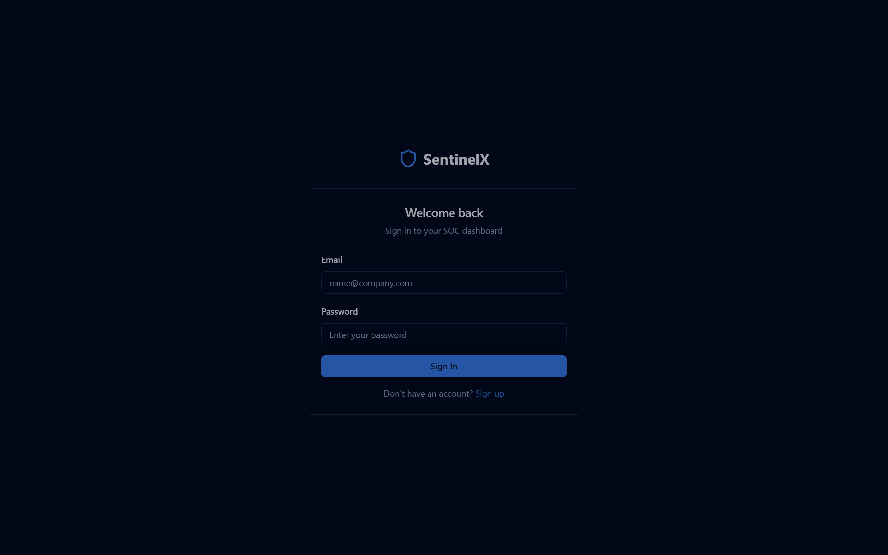 | 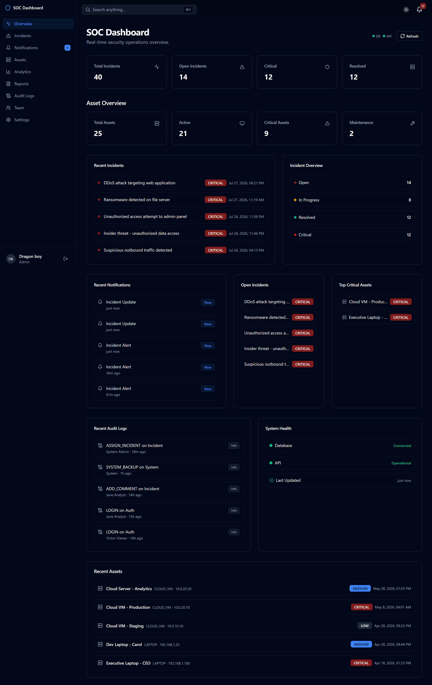 | 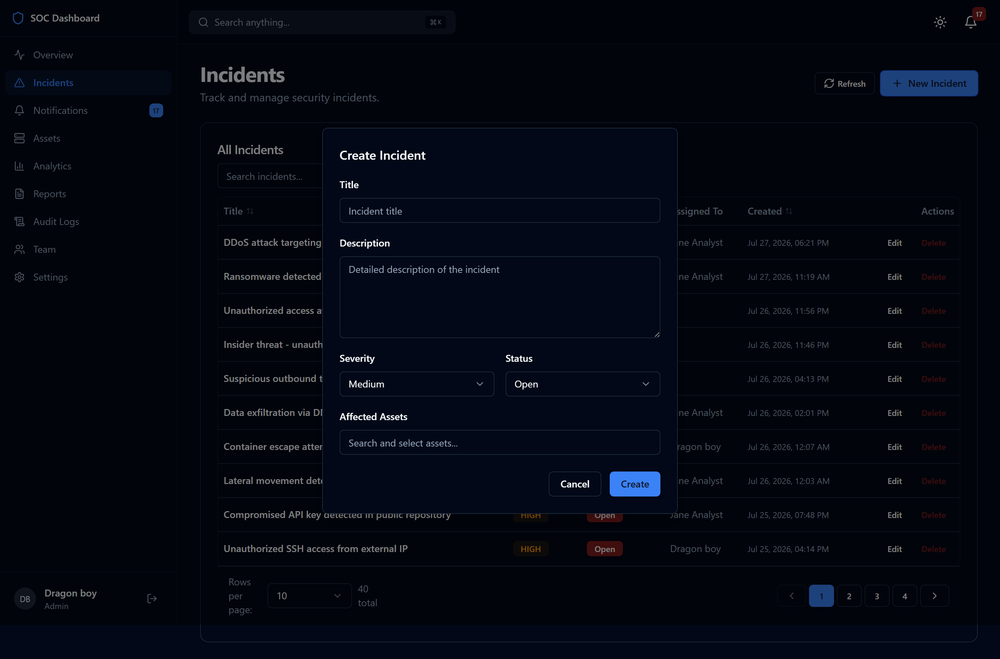 |
| 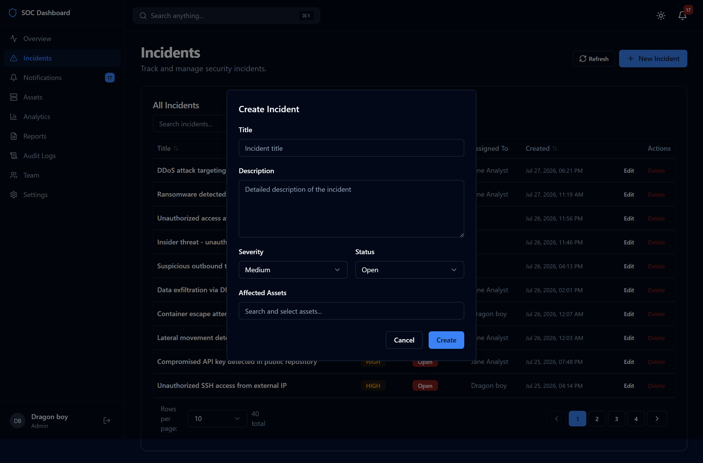 | 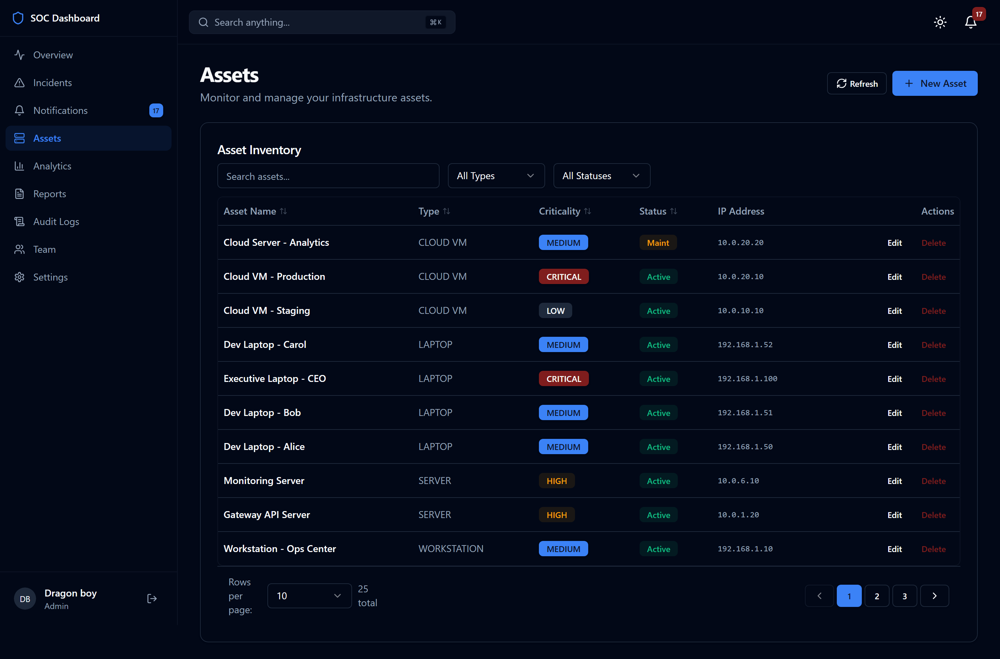 | 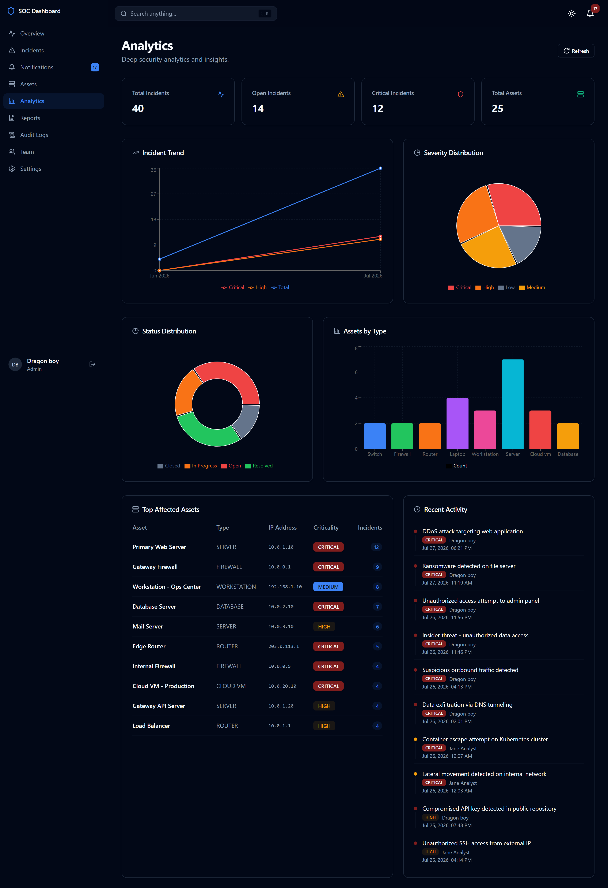 |
| 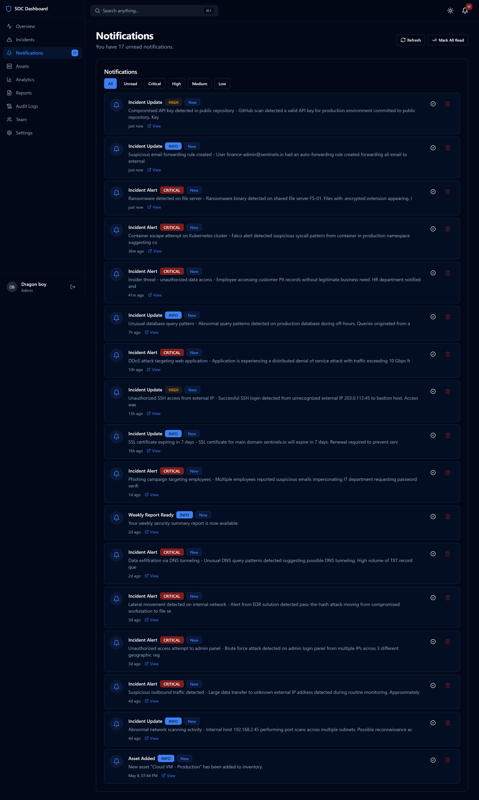 | 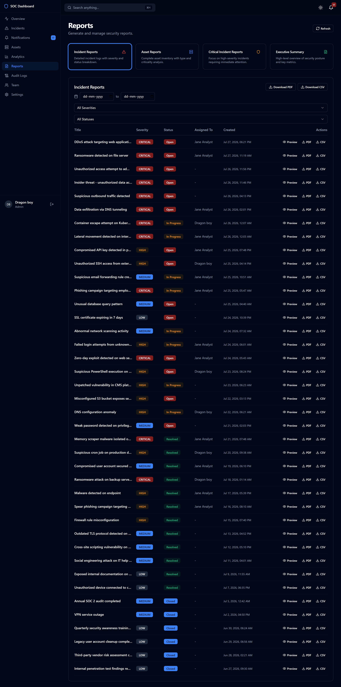 | 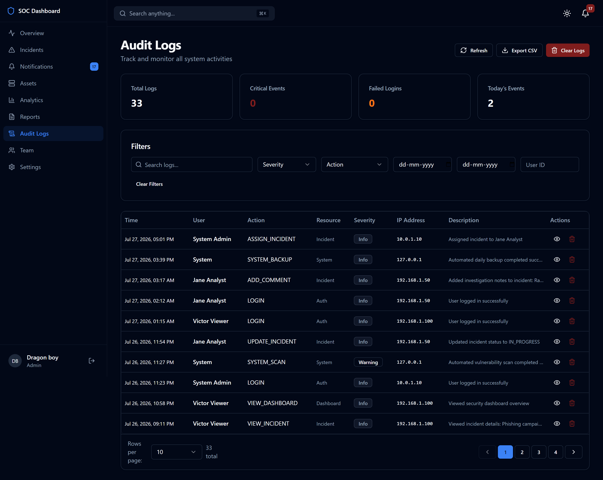 |
| 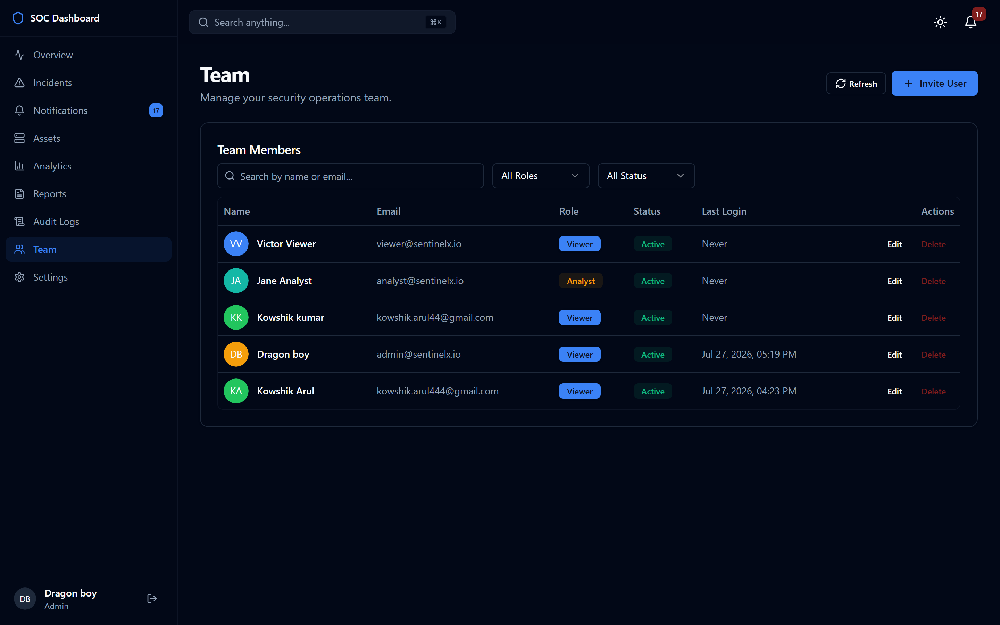 | 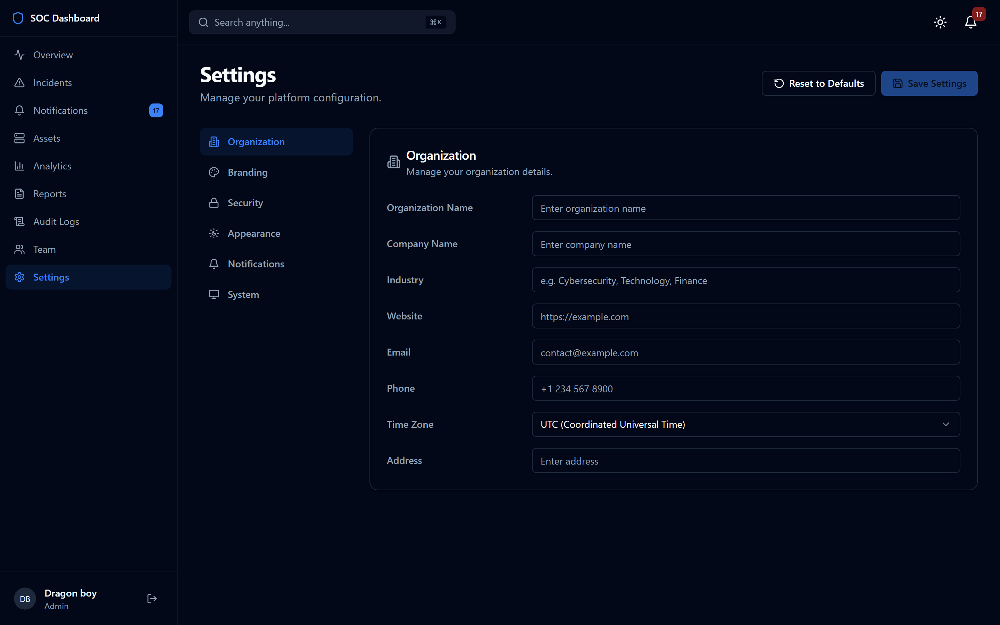 |  |

---

## License

MIT

---

*Built with TypeScript, React, Express, and ❤️*
